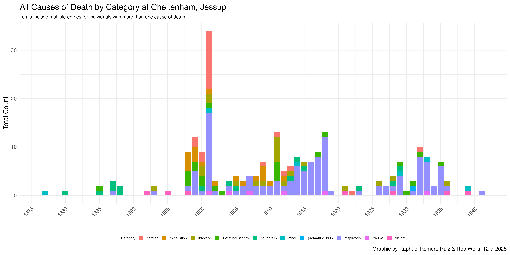
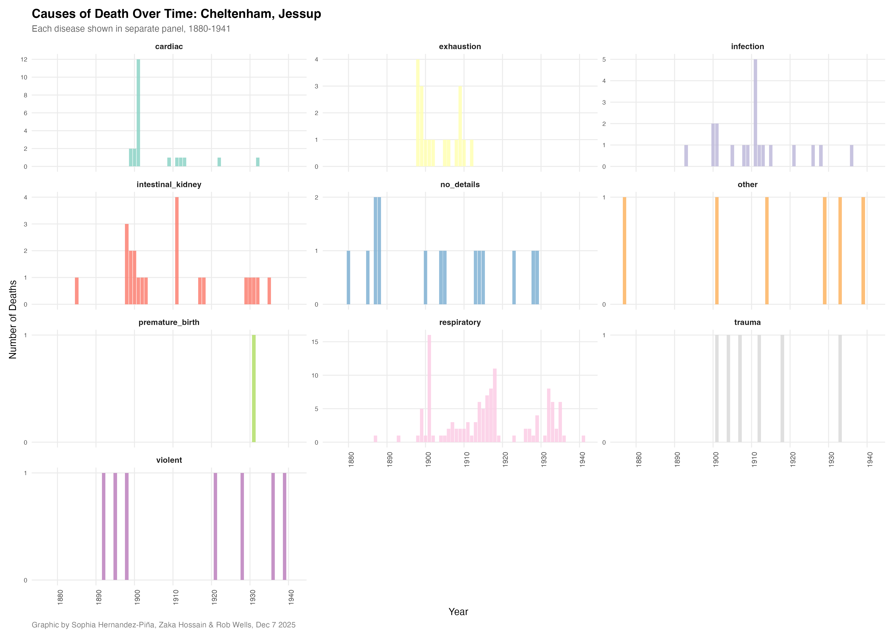
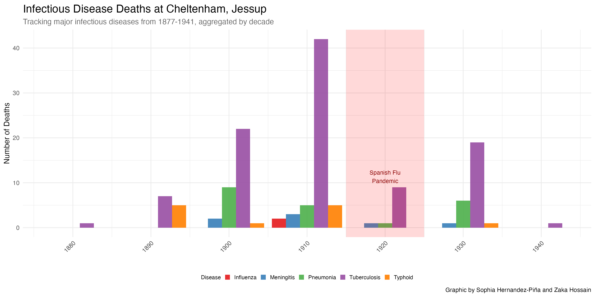

```{r setup, include=FALSE}
# title: "Summary Findings"
# author: "Wells and Jour 772 Class"
# date: "2025-11-30"
knitr::opts_chunk$set(echo = TRUE)
```


```{r include=FALSE}
# install.packages("htmlwidgets")
# install.packages("leaflet")
#install.packages("sf")
#install.packages('DT')
#install.packages("formattable")
library(DT)
library(tidyverse)
library(rio)
library(janitor)
library(htmlwidgets)
library(leaflet)
library(sf)
library(googlesheets4)
library(formattable)
```

<center>

### NOT FOR PUBLICATION: DEC 8 2025 DRAFT 

# Death Certificates of Cheltenham, Jessup, Hickey Youth

### Draft analysis by Capital News Service

### NOT FOR PUBLICATION: DEC 8 2025 DRAFT 
### NOT FOR PUBLICATION: DEC 8 2025 DRAFT 

<center>


</center>

We have confirmed records for **177 deaths**, including 142 for Cheltenham and 34 for Jessup and 1 for Hickey

### Sample death certificate


## Processed through Google Gemini AI


```{r include=FALSE}
#Import Extracted Death Certificate Data

extracted_dc <- read_csv("input/master_dc_data_dec_8.csv")


```

## Statistics

**Age 16 is the median age of death.**

```{r echo=FALSE}
summary(extracted_dc$age, NA.rm=true)

# Two infants died at birth at Jessup, being the youngest. The youngest died at about age 9 and the oldest at age 21. The average age was 15.6 years and the median was age 16
```


## Deaths by Institution

```{r echo=FALSE}
extracted_dc |> 
  mutate(facility = str_to_sentence(facility)) |> 
  count(facility) |> 
  arrange(desc(n)) |> 
  rename(Facility = facility, Total = n) |> 
datatable(caption = "Total Deaths by Institution",
          options = list(
            pageLength = 5,
              dom = 't' ))

```

We have records for 142 deaths of boys and young men at Cheltenham, 34 at Jessup and 1 at Hickey.

## Graph of age

```{r echo=FALSE}
extracted_dc |> 
  filter(age!="NA") |> 
  group_by(age) |> 
  summarise(total = n()) |> 
ggplot(aes(x = age, y = total, fill = total)) +
  geom_col(position = "dodge") +
  theme(legend.position = "none") +
  scale_x_continuous(breaks=c(9:21)) +
  labs(title = "Ages of Cheltenham, Jessup youth deaths",
       subtitle = "From 1877-1941, Approximate Ages",
       caption = "n=178. Graphic by Rob Wells, 12-5-2025",
       y="Number",
       x="Approximate Ages")


```

## Distribution of Cases
```{r echo=FALSE}

extracted_dc |> 
  mutate(death_year = year(death_date),
         death_decade = floor(death_year / 10) * 10) |> 
  group_by(death_year) |> 
  count() |> 
ggplot(aes(x = death_year, y = n, fill = n)) +
  geom_col(position = "dodge") +
  theme(legend.position = "none") +
  scale_x_continuous(breaks= seq(1870,1950, 5)) +
  labs(title = "Total Documented Cheltenham, Jessup, Hickey Youth deaths",
       subtitle = "From 1877-1941",
       caption = "n=178. Graphic by Rob Wells, 12-5-2025",
       y="",
       x="death_year")

```


## Race of the boys

```{r echo=FALSE}


extracted_dc |> 
   mutate(race_color = case_when(
     is.na(color_or_race) ~ "No Data", 
     TRUE ~ color_or_race)
         ) |> 
  count(race_color) |> 
  mutate(pct = formattable::percent(n/sum(n), digits=0)) |>
   ggplot(aes(x = reorder(race_color, -n), y = n, fill =n))+
  geom_col(position = "dodge") +
  theme(legend.position = "none") +
  scale_y_continuous(limits=c(0,170)) +
  geom_text(aes(label = (n)), size = 4, vjust = -.5) +
  labs(title = "Race of Cheltenham, Jessup youth deaths",
       subtitle = "From 1880-1939, Approximate Ages",
       caption = "n=172. Graphic by Rob Wells, 11-30-2023",
       y="Number",
       x="Race")


```

## Primary Causes of Death

```{r include=FALSE}
summary_death <- read_csv("output/primary_death_categories_summary_dec5.csv") |> 
  rename(category = cause) |> 
 mutate(category = str_to_sentence(category)) |> 
  filter(!category =="No_details")
```  

```{r echo=FALSE}
datatable(summary_death,
          caption = "Primary Causes of Death, Cheltenham, Jessup, 1877-1941",
          options = list(pageLength = 10))

```

## Occupations of Boys
```{r echo=FALSE}

extracted_dc |> 
  group_by(occupation) |> 
  count(occupation) |> 
  arrange(desc(n)) |> 
  datatable(caption = "Occupations of Cheltenham, Jessup Boys, 1877-1941",
          options = list(pageLength = 10))

```


## Boys and Causes of Death
```{r echo=FALSE}
extracted_dc |> 
  rename(Age = age, Death_Date = death_date, Name = name, Cause = cause_of_death, Race = color_or_race) |> 
  select(Name, Age, Cause, Death_Date, Race) |> 
  arrange(Death_Date) |> 
   datatable(caption = "Names Deceased Boys Cheltenham, Jessup, Hickey, 1877-1941",
          options = list(pageLength = 25))


```

<br>

## All Causes of Death

**A summary of all causes of death, primary and secondary, written on the death certificates**

<br>

<center>



</center>

<br>
**Decade breakdown all causes of death, primary and secondary**

<br>

<center>



</center>

<br>
<br>
**Infectious diseases all causes of death, primary and secondary**
<br>



<br>
<br>

## Origins of the boys

```{r echo=FALSE}
#needs an update
map <- readRDS("output/dc_map_dec_8.rds")


map <- map |> 
  st_as_sf() |> 
  sf::st_transform(4326) |> 
  add_count(county_origin, name = "county_count")

# Use colorFactor for categorical data
pal <- colorFactor(
  palette = "viridis",  # or "Set1", "Dark2", etc for categories
  domain = map$county_count
)
# Create summary data
summary_data <- map %>%
  count(county_origin) %>%
  filter(county_origin %in% c("Maryland", "Unknown", "Outside Maryland"))

# Create HTML table
table_html <- paste0(
  '<table style="background-color: white; padding: 10px; border: 2px solid gray;">',
  '<tr><th style="text-align: left; padding: 5px;">Origin</th>',
  '<th style="text-align: right; padding: 5px;">Count</th></tr>',
  '<tr><td style="padding: 5px;">Maryland</td><td style="text-align: right; padding: 5px;">45</td></tr>',
  '<tr><td style="padding: 5px;">Unknown</td><td style="text-align: right; padding: 5px;">25</td></tr>',
  '<tr><td style="padding: 5px;">Outside Maryland</td><td style="text-align: right; padding: 5px;">7</td></tr>',
  '</table>'
)

# Create headline
headline_html <- paste0(
  '<div style="background-color: white; padding: 10px; border: 2px solid #333; border-radius: 5px; box-shadow: 0 0 10px rgba(0,0,0,0.3); text-align: center;">',
  '<h3 style="margin: 0; color: #333;">Birth Places of Deceased Boys at Maryland Institutions</h2>',
  '</div>'
)

leafMap <- leaflet(data = map) %>%
  addProviderTiles(providers$Esri.WorldStreetMap) %>%
  addControl(html = headline_html, position = "topright") %>%  # or "topleft"
  addPolygons(
    color = ~pal(county_count),
    weight = 2.5,
    fillOpacity = 0.5,
    label = ~paste0("Count of deceased boys from ", county_origin, ": ", county_count)
  ) %>%
  addControl(html = table_html, position = "bottomleft")

leafMap

```


### NOT FOR PUBLICATION: DEC 82025 DRAFT 
### NOT FOR PUBLICATION: DEC 82025 DRAFT 