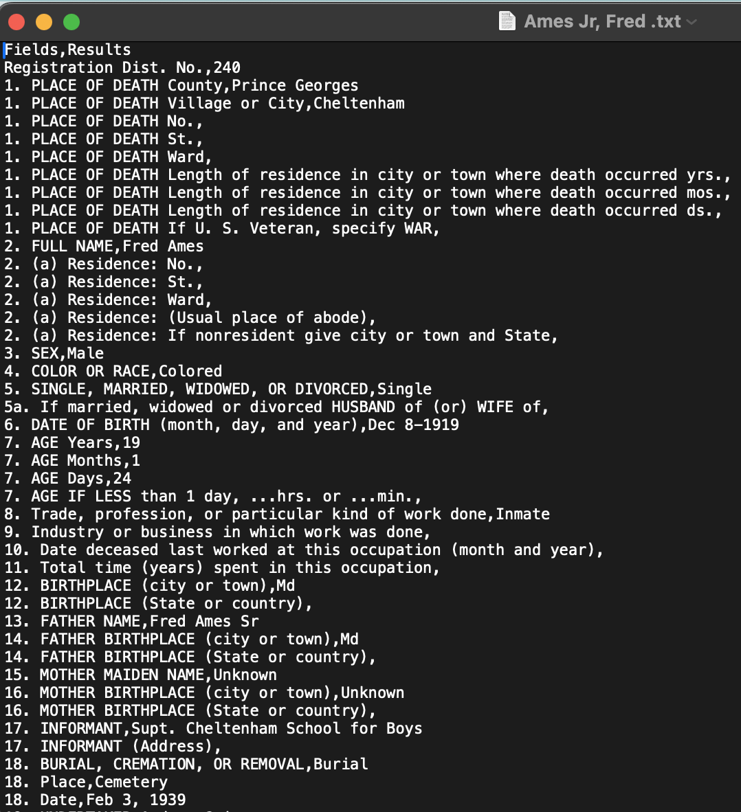

```{r setup, include=FALSE}
knitr::opts_chunk$set(echo = TRUE)
```

Load libraries
```{r include=FALSE}
# install.packages("htmlwidgets")
# install.packages("leaflet")
#install.packages("sf")
#install.packages('DT')
library(DT)
library(tidyverse)
library(rio)
library(janitor)
library(htmlwidgets)
library(leaflet)
library(sf)
library(googlesheets4)
```
# Summary Data Analysis of Cheltenham, Jessup Death Certificates for Young Inmates

 

We analyzed **203 death certificates**, including 170 for Cheltenham and 31 for Jessup and 2 for Hickey

### Sample death certificate


## Processed through Google Gemini AI




Import Extracted Death Certificate Data
```{r include=FALSE}

gs4_deauth()  
extracted_dc <- read_sheet("https://docs.google.com/spreadsheets/d/1iSCOX71aGdY9t39qPS1ABvAzSDIOqeAV58zjv2LCxMc/edit?usp=sharing", col_types = "c") |> 
     clean_names() |> 
  mutate(approx_age = as.numeric(approx_age),
         death_year = as.numeric(death_year))


```

## Statistics
```{r}
summary(extracted_dc$approx_age, NA.rm=true)

# Two infants died at birth at Jessup, being the youngest. The youngest died at about age 9 and the oldest at age 21. The average age was 15.5 years and the median was age 16
```

## Count of institution

```{r}
extracted_dc |> 
  mutate(facility = tolower(facility)) |> 
  count(facility) |> 
  arrange(desc(n))

```


We have records for 170 deaths of boys and young men at Cheltenham, 31 at Jessup and 2 at Hickey.


## Graph of age
```{r echo=FALSE}
extracted_dc |> 
  filter(approx_age!="NA") |> 
  group_by(approx_age) |> 
  summarise(total = n()) |> 
ggplot(aes(x = approx_age, y = total, fill = total)) +
  geom_col(position = "dodge") +
  theme(legend.position = "none") +
  scale_x_continuous(breaks=c(9:21)) +
  labs(title = "Ages of Cheltenham, Jessup youth deaths",
       subtitle = "From 1880-1939, Approximate Ages",
       caption = "n=203. Graph does not have ages for 53 individuals. Graphic by Rob Wells, 11-26-2023",
       y="Number",
       x="Approximate Ages")


```


## Top Causes of Death

```{r echo=FALSE}
summary_death <- read_csv("output/death_categories_summary_nov26.csv")


datatable(summary_death,
          caption = "Causes of Death, Cheltenham, Jessup",
          options = list(pageLength = 50))

```


## Origins of the boys
read map file
```{r echo=FALSE}

map <- readRDS("output/dc_map_nov_26.rds")


map <- map |> 
  st_as_sf() |> 
  sf::st_transform(4326) |> 
  add_count(county_origin, name = "county_count")

# Use colorFactor for categorical data
pal <- colorFactor(
  palette = "viridis",  # or "Set1", "Dark2", etc for categories
  domain = map$county_count
)
# Create summary data
summary_data <- map %>%
  count(county_origin) %>%
  filter(county_origin %in% c("Maryland", "Unknown", "Outside Maryland"))

# Create HTML table
table_html <- paste0(
  '<table style="background-color: white; padding: 10px; border: 2px solid gray;">',
  '<tr><th style="text-align: left; padding: 5px;">Origin</th>',
  '<th style="text-align: right; padding: 5px;">Count</th></tr>',
  '<tr><td style="padding: 5px;">Maryland</td><td style="text-align: right; padding: 5px;">45</td></tr>',
  '<tr><td style="padding: 5px;">Unknown</td><td style="text-align: right; padding: 5px;">25</td></tr>',
  '<tr><td style="padding: 5px;">Outside Maryland</td><td style="text-align: right; padding: 5px;">7</td></tr>',
  '</table>'
)

# Create headline
headline_html <- paste0(
  '<div style="background-color: white; padding: 10px; border: 2px solid #333; border-radius: 5px; box-shadow: 0 0 10px rgba(0,0,0,0.3); text-align: center;">',
  '<h3 style="margin: 0; color: #333;">Birth Places of Deceased Boys at Maryland Institutions</h2>',
  '</div>'
)

leafMap <- leaflet(data = map) %>%
  addProviderTiles(providers$Esri.WorldStreetMap) %>%
  addControl(html = headline_html, position = "topright") %>%  # or "topleft"
  addPolygons(
    color = ~pal(county_count),
    weight = 2.5,
    fillOpacity = 0.5,
    label = ~paste0("Count of deceased boys from ", county_origin, ": ", county_count)
  ) %>%
  addControl(html = table_html, position = "bottomleft")

leafMap

```
