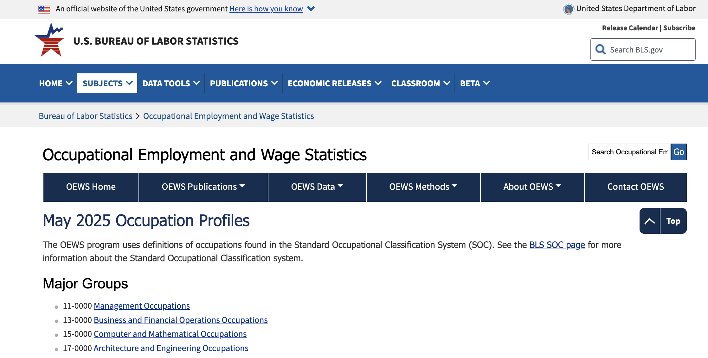

# Economic Portrait of Greater Philadelphia region

For this assignment, you will explore the Bureau of Labor Statistics and Bureau of Economic Analysis databases to build a portrait of the major employers and economic trends in the greater Philadelphia area. Along the way, you will develop a story pitch about something you have discovered in the data.

Memo from your newsroom:

There isn’t a specific topic or dataset required for this role. It’s more important for the intern to begin thinking about how to shape story ideas around our coverage area. Since Yueyang is not from the region, becoming familiar with Philadelphia and the surrounding counties, including Montgomery County, Bucks County, Chester County, Delaware County, as well as Gloucester County, Camden County, and Burlington County, would be especially valuable.

Our team works across the newsroom, so assignments may span a range of topics. We encourage the intern to pursue enterprise work on a topic of their choosing and begin developing those ideas during the training camp.

> **Learning Outcome:**. <br> You will learn to how to retrieve and
> analyze employment and regional GDP data for their own counties or
> states and the steps to put it on a basic interactive charts. 

# Step 1: Storytelling with Employment Data

In this exercise, we will find out how much the typical engineer makes
versus the typical journalist.

Follow this example for the counties in Pennsylvania and then we'll have you do the same for New Jersey and Delaware

> [Check out the Pennsylvania Occupational Employment and Wage Statistics
> GDP press release: "CNTL" + click for a New
> Tab](https://data.bls.gov/oes/#/home){target="_blank"}

 <br>

<br>

> Scroll down to the table, **use the search box and type in "waiter."**
> You'll see mean hourly wage for waiters in Maryland is ... ???

<br>

<br>  <br>

<br> **Questions**:

```         
What is the median hourly wage for Chief Executives?
What is the annual mean wage for Gambling Dealers?
```

<br>

Let's pull in the data and examine it

```{r include=FALSE}
#Load libraries
library(tidyverse)
library(readxl)
library(janitor)
```


```{r}
#note the mutate sequence, converts columns 12-32 into integers. Slick!

oes <- read_excel("../data/OES_state_M2025_dl.xlsx") |> 
  clean_names() |> 
   mutate(across(12:32, as.numeric))

glimpse(oes)
```

Now check Pennsylvania totals
```{r}
#note the search for the list: %in% checks whether each value is anywhere in the vector
oes |> 
  filter(area_title == "Pennsylvania") |> 
  filter(occ_title %in% c("Chief Executives", "News Analysts, Reporters, and Journalists", "Waiters and Waitresses")) |> 
  select(prim_state, occ_title, tot_emp, h_mean, a_mean)

```

What do these fields mean?

```{r}

names <- read_excel("../data/OES_state_M2025_dl.xlsx", sheet='Field Descriptions') |> 
  apply(1, paste, collapse = ": ") |>
sapply(\(x) c(strwrap(x, width = 80), "")) |>
  unlist() |>
  writeLines("temp_text.txt")

file.edit("temp_text.txt")
```


Source of the data:
> [Occupational Employment and Wage Statistics, national index, 2025. Select 'State' in HTML: "CNTL" + click for a New
> Tab](https://www.bls.gov/oes/tables.htm){target="_blank"}


# Look at Philly metro area
```{r}

philly <- read_excel("/Users/gizmofo/Code/djnf-data-2026/master/data/OES_Report_Philly_metro.xlsx", skip=2) |> 
  clean_names() |> 
    mutate(across(4:20, as.numeric))

glimpse(philly)

```


Practice Questions
```   
What is the median hourly wage for actors?
What is the median hourly wage for surgeons?
Compare journalists annual wage in two different states.
How does that annual journalist salary compare to the state average?
How could that be a story?

```

More pokin' around:
Examine the OCC_CODE column. The occupations ending in "0000" are occupational categories. Filter OCC_CODE for "0000" and examine the 23  occupational categories.


4) 
--Apply Filter to OCC_Code. 
--Select Filter by Condition. 
--Select Text contains. 
--Type in -0000 and apply
You now will have a list of the 23 occupational categories

<br>

<br>


# Step 2: Storytelling with Local GDP Data

<br>

GDP tells us if the economy is great or if it sucks.

It's the **Big Daddy of economic indicators**.

What is Gross Domestic Product? It measures the value of all final goods
and services produced in the country in a year.

For example: that would be all of the stuff sold by Walmart and all of
the beer sold by Liquor Barn and all of the gas pumped at Citgo, etc.,
AND A WHOLE LOT MORE, over a year.

You get the idea.

You can break it down to a state or a region, and also break it down
into three month periods.

As a reporter, you can use local GDP data to figure out what business
sectors are doing well and which ones stink. It can lead you to
excellent stories.

This section will analyze the storytelling possibilities with the Gross
Domestic Product by County data.

[Check out the local GDP press
release for 2024](https://www.bea.gov/newsreleases/regional/gdp_metro/gdp_metro_newsrelease.htm){target="_blank"}

> What's in the GDP data

"Gross domestic product (GDP) by metropolitan area is the sub-state
counterpart of the Nation's gross domestic product (GDP), the Bureau's
featured and most comprehensive measure of U.S. economic activity. GDP
by metropolitan area is derived as the sum of the GDP originating in all
the industries in the metropolitan area.

Contributions to growth are an industry's contribution to the state's
overall percent change in real GDP. The contributions are additive and
can be summed to the state's overall percent change. The statistics of
GDP by metropolitan area released today are consistent with statistics
of GDP by state.

GDP at chained volume measure is adjusted for the effect of inflation to
give a measure of ‘real GDP’."

**Data limitations**

This data series lags significantly. We are working with 2021 data, the
most recent available. But it is still the best you can get and you
can't beat the price.

<br>

### Retrieve GDP Data

<br> <br>  <br> <br>

GDP
CAGDP1 County gross domestic product (GDP) summary
Real Gross Domestic Product (GDP) (Thousands of chained 2017 dollars)
Source Page
https://www.bea.gov/news/2026/gross-domestic-product-county-and-personal-income-county-2024

```{r}
gdp_county <- read_csv("../data/bea_gdp_2024_county_CAGDP1.csv", skip=3) |> 
  clean_names() |> 
    mutate(across(3:5, as.numeric))

glimpse(gdp_county)
```


Calculate change 2024 vs 2022; split out state
```{r}

gdp_county <- gdp_county |> 
  mutate(pct_24_v_22 = (x2024-x2022)/x2022,
          state = str_split_fixed(geo_name, ", ", 2)[, 2],
         county = str_split_fixed(geo_name, ", ", 2)[, 1])  

```


Personal income
CAINC1 County personal income summary: personal income, population, per capita personal income
Personal income (Thousands of dollars)
https://www.bea.gov/news/2026/gross-domestic-product-county-and-personal-income-county-2024


```{r}
p_income <- read_csv("../data/bea_gdp_2024_personal_income_county_CAINC1.csv", skip=3) |> 
  clean_names() |> 
    mutate(across(3:5, as.numeric))

glimpse(p_income)
```


> [Click here to download the Excel
> tables](https://www.bea.gov/sites/default/files/2022-12/lagdp1222.xlsx){target="_blank"}

You should have a **file named "lagdp1222.xlsx"** downloaded. Open it
up.


BEA API
https://apps.bea.gov/API/signup/


<br>

> Let's see what we have.\
> \* One table of data.\
> \* 3,223 rows with county data.\
> \* GDP for four years, percentage change, and state ranking.

<br> For this exercise, I cut down the table to Maryland-only data.

> [Maryland 2021
> GDP](https://docs.google.com/spreadsheets/d/1UzdiXfGXGGcY3lokwxrLIs7HapXfz-2Uj0lBPTGA2z4/edit?usp=sharing){target="_blank"}

#### Walk through the GDP table:

Inflation adjusted GDP, chained to 2012. Dollar amounts in thousands

This is cool because it has the percentage change growth, 2019/2021, and
ranks it.

> Let's interrogate this table a bit.

```         
1--Sort counties according to total GDP in 2021
2--Sort counties according to 2021_pct_rank_state 

Were you surprised to see the top county by GDP?
How are the lists different? 
What are some potential stories?

3--Next, look for the losers. Which counties saw declines in 2021 GDP? 
```

<br>

> **Question: What is the basic number for comparison with percentage
> GDP growth in 2021? In other words, what is the benchmark metric?**

<!--Answer: US 5.9% growth. Maryland, 4.6% growth Is your region above or below that benchmark?-->

<br>

**Data Cleaning**

The Google sheet you have has been cleaned and modified so it will play
well with Datawrapper. Basically, the BEA spreadsheet was cleaned to
remove merged cells and new headers were created.

Here is a [10-minute
video](https://www.youtube.com/embed/5bS-GKvFzBk){target="_blank"} on
basic data cleaning, using an older version of the data, which you can
watch later.

<br>

### Build a GDP chart

> [Go to
> Datawrapper](https://app.datawrapper.de/signin?){target="_blank"}

```         
1--Select "Create new" and select chart.
2--Select "Connect Google Sheet" and paste URL from our Maryland 2021 GDP sheet: 
https://docs.google.com/spreadsheets/d/1UzdiXfGXGGcY3lokwxrLIs7HapXfz-2Uj0lBPTGA2z4/edit?usp=sharing
  a--Select "Proceed"
3--Check and Describe, make sure all was imported correctly
  a--Select Maryland and United States rows and delete
  b--Select all columns EXCEPT 2021_GDP and "Hide column from visualization" then click "Proceed"
4--Visualize
    a--Select Area Chart
    b--Select Refine Tab
        * Bars = A_Mean
        * Labels = OCC_TITLE
        * Show Values: Number format: Custom and paste in this into the box: $(0,0.000)
        * Sorting and Grouping: Select Reverse Order
        
    c--Select Annotate Tab
        * Type in a headline, description, Data Source, link to original data and your byline. 
        * Add text annotation to label Montgomery County's peak.
        
    d--Layout Tab: Click for social media sharing
 
 5--Click publish & Embed
```

<!--https://datawrapper.dwcdn.net/p6oP9/1/-->

<iframe title="Montgomery County Dominates Maryland&#39;s Economy" aria-label="Interactive area chart" id="datawrapper-chart-p6oP9" src="https://datawrapper.dwcdn.net/p6oP9/3/" scrolling="no" frameborder="0" style="border: none;" width="600" height="719" data-external="1">

</iframe>

<br>

<br>

### GDP chart: State, National Context

This follows similar steps as above but the visualization is on the 2021
percentage change, which allows comparisons to the state and national
levels.

```         
1--Select "Create new" and select chart.
2--Select "Connect Google Sheet" and paste URL from our Maryland 2021 GDP sheet: 
https://docs.google.com/spreadsheets/d/1UzdiXfGXGGcY3lokwxrLIs7HapXfz-2Uj0lBPTGA2z4/edit?usp=sharing
  a--Select "Proceed"
3--Check and Describe, make sure all was imported correctly
  a--Select all columns EXCEPT 2021_pct_chg and "Hide column from visualization" then "Proceed"
4--Visualize
  a--Select Bar Chart
  b--Select Refine Tab
          * Show Values
          * Number format: Custom and paste in this into the box: 0.0%
          * Appearance: Customize colors. Turn United States red; Maryland, orange
          * Sorting and Grouping: Sort bars
      
   c--Select Annotate Tab
          * Type in a headline, description, Data Source, link to original data and your byline. 
          * Add text annotation to label Montgomery County's peak.
   d--Layout Tab: Click for social media sharing

 5--Click publish & Embed
 
```

<!--https://datawrapper.dwcdn.net/vwtwJ/1/-->

<iframe title="Eastern Shore Counties Exceed U.S. Growth Rate" aria-label="Bar Chart" id="datawrapper-chart-vwtwJ" src="https://datawrapper.dwcdn.net/vwtwJ/1/" scrolling="no" frameborder="0" style="width: 0; min-width: 100% !important; border: none;" height="718" data-external="1">

</iframe>

```{=html}
<script type="text/javascript">!function(){"use strict";window.addEventListener("message",(function(e){if(void 0!==e.data["datawrapper-height"]){var t=document.querySelectorAll("iframe");for(var a in e.data["datawrapper-height"])for(var r=0;r<t.length;r++){if(t[r].contentWindow===e.source)t[r].style.height=e.data["datawrapper-height"][a]+"px"}}}))}();</script>
```

> You now have a GDP growth chart for the counties in Maryland with
> statewide and U.S. comparison figures.

<br>

<br>

# Step 4: Basic Map

<br>.

> **We'll use Datawraper again to build a chloropleth map of the total
> GDP per county in Maryland.**

```         
1--Select "Create new" and select Map and then "Chloropleth map."
2--Type "Maryland" in the search box and select "USA>>Maryland>>Counties" and then "Proceed"
3--Add your data, select Connect Google Sheet at the bottom. Use this version, which omits the U.S. and Maryland totals:
https://docs.google.com/spreadsheets/d/149YeVPvnyUAFW2KUv9vCapTcLrtFLYloCj79A4on6y0/edit#gid=1143515708
   a--Values, select 2021_GDP then "Proceed"
4--Visualize, select "Annotate" tab
    a--Tooltips, find county_name and select for the title box. The value should be 2021_gdp
    b--Select Show labels, place names appear on map
    c--Type in a headline, description, Data Source, link to original data and your byline. 
    Select "Refine" tab
    a--Legend - Format - custom: $(0,0.00)
    
    And Proceed to Publish
```

<!--https://datawrapper.dwcdn.net/UY7hG/1/-->

<br>

> **Your finished map should look like this:**

<br> <br>
<iframe title="Montgomery County Powers Maryland's Economy" aria-label="Map" id="datawrapper-chart-UY7hG" src="https://datawrapper.dwcdn.net/UY7hG/2/" scrolling="no" frameborder="0" style="width: 0; min-width: 100% !important; border: none;" height="457" data-external="1"></iframe>

```{=html}
<script type="text/javascript">!function(){"use strict";window.addEventListener("message",(function(e){if(void 0!==e.data["datawrapper-height"]){var t=document.querySelectorAll("iframe");for(var a in e.data["datawrapper-height"])for(var r=0;r<t.length;r++){if(t[r].contentWindow===e.source)t[r].style.height=e.data["datawrapper-height"][a]+"px"}}}))}();
</script>
```

<br>

<br>

# Nerd Corner - Advanced Users.

- If you are good with this tutorial, then you can go back to the BEA
  website, look at the Regional Economic Accounts page and grab data for
  [income trends per county since
  1969](https://apps.bea.gov/regional/downloadzip.cfm){target="_blank"}.

- Or you can look for data on [industry-specific sector
  growth](https://apps.bea.gov/regional/downloadzip.cfm){target="_blank"}

  Select Personal Income (State and Local) and then "CAEMP25N: Total
  Full-Time and Part-Time Employment by NAICS Industry." This is a huge
  dataset and you can track county level employment in any of these
  sectors:

  - Arts, entertainment, recreation, accommodation, and food services\
  - Construction\
  - Durable-goods manufacturing\
  - Educational services, health care, and social assistance\
  - Finance, insurance, real estate, rental, and leasing\
  - Government\
  - Information\
  - Professional and business services
  - Trade\
  - Transportation and utilities\
    <br>

> Detailed Instructions to Obtain More In-Depth GDP Data

 <br>

> **With the regional data. heres's one option to profile a county's
> economy:**

<br>

<iframe title="Montgomery County&#39;s Employment Picture Over Two Decades" aria-label="Split Bars" id="datawrapper-chart-Y4E92" src="https://datawrapper.dwcdn.net/Y4E92/1/" scrolling="no" frameborder="0" style="border: none;" width="600" height="991" data-external="1">

</iframe>

<br>

> **Duplicate and Iterate.**\
> The great thing about this data work is you can iterate and improve on
> your work. My tip: save the version you like, then copy it and refine
> it again. Now, go experiment and figure out some other visualization!

<br>

<br> <br>

> **More Resources.**\
> I recorded a series of lectures for the Sage Research Methods video
> series on data visualization and research. You can find them here:

[**“Practical Tips for Doing Online Archival
Research.”**](https://dx.doi.org/10.4135/9781529604528){target="_blank"}.

[**“Storytelling With Big Data: An Example From COVID-19
Data.”**](https://dx.doi.org/10.4135/9781529602760){target="_blank"}.

[**“Choosing the right visualization tools for COVID-19
data.”**](https://www.doi.org/10.4135/9781529778342){target="_blank"}.

<br> <br>

### Follow up questions:

- Rob Wells - [robwells\@umd](mailto:robwells@umd){.email}

**Based on an earlier presentation with these co-authors**

- Jeannine Aversa, Bureau of Economic Analysis,
  [Jeannine.Aversa\@bea.gov](mailto:Jeannine.Aversa@bea.gov){.email}

- Thomas Dail, Bureau of Economic Analysis,
  [Thomas.Dail\@bea.gov](mailto:Thomas.Dail@bea.gov){.email}

<br>

**Thank you.**


**--30--**
