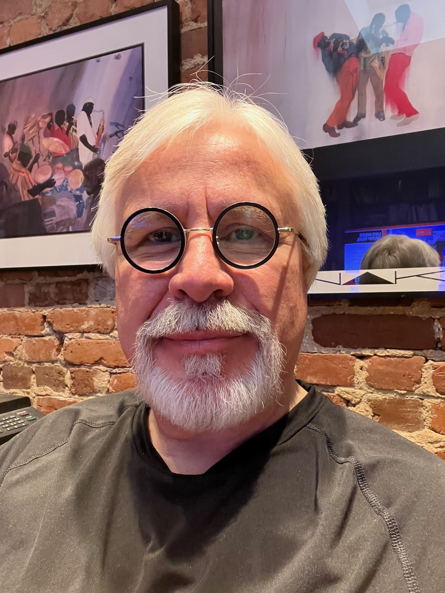

::: {style="text-align: center; color: #036ffc;"}
# Dow Jones News Fund Data Guest Speakers 2025

[(ver May 22, 2025)]{style="font-size: 8pt;"}
:::

::: {style="display: flex; align-items: center; justify-content: center; gap: 20px; margin-top: 30px;"}

:::

**Cheryl W. Thompson**

Cheryl W. Thompson is an investigative correspondent for NPR.

Since becoming the inaugural editor of the stations investigations team
in 2021, where she is a player/coach, she has collaborated with Member
stations in Texas, California, Georgia, Illinois, Kentucky, Missouri,
Montana, Oregon and Washington, and with Columbia University and several
nonprofits, to do award-winning work, including "Hot Days: Heat's
Mounting Death Toll on Workers in the U.S.," an investigation into how
Black and brown workers in the U.S. were dying on the job for lack of
water and shade breaks. That series won several awards in 2022,
including an IRE and National Headliner. An examination of racial
covenants still on the books throughout the U.S. won a National
Headliner award and an award from the National Association of Black
Journalists. An investigation into deaths at tribal jails won awards
from PMJA and the Native American Journalists Association. And an
investigation into ballot drop boxes in Georgia after the 2020
presidential election won a 2023 NABJ award.

She also served as the investigative reporting coach on the No
Compromise podcast that won the 2021 Pulitzer Prize for Audio Reporting.
That same year, NPR honored her with the Public Service Journalism award
given annually to one journalist. She served as a Pulitzer juror for
investigative reporting in 2022 and chaired the jury in 2023.

Prior to joining NPR in January 2019, Thompson spent 22 years at The
Washington Post, where she wrote extensively about law enforcement,
political corruption and guns, and was a White House correspondent
during Barack Obama's first term. Her investigative series that traced
the guns used to kill more than 500 police officers in the U.S. earned
her an Emmy, a National Headliner, an IRE, a White House News
Photographers Association and other awards. In 2015, her reporting found
that nearly one person a week died in the U.S. after being Tasered by
police. The story was part of a yearlong series on police shootings in
the U.S. that won the Pulitzer Prize for national reporting.

In 2017, her examination of Howard University Hospital revealed myriad
problems with the storied facility, including that it had a higher rate
of death lawsuits per bed than the five other D.C. hospitals. Her
project published in the Washington Post Sunday Magazine in May 2018
investigated the unsolved serial murders of six Black girls in the
nation's capital nearly 50 years ago; it later won an SPJ DC award for
magazine feature writing and an NABJ award for investigative reporting.
She has won numerous other national awards, and was named NABJ's
Educator of the Year in 2017 for her teaching and mentoring at George
Washington University. She was part of the Washington Post team that won
the Pulitzer Prize for national reporting in 2002 for coverage of Sept.
11.

Thompson is the past president of Investigative Reporters and Editors, a
6,000-member organization whose mission is to improve the quality of
investigative journalism. In 2018, she became the first Black elected
president in its 43-year history and served for three terms before being
elected board chairman in 2021. She also teaches investigative reporting
as an associate professor at GWU, where she founded a student NABJ
chapter in 2014, and is a member of Alpha Kappa Alpha Sorority, Inc.

 

**Chad Day**

Chad Day is [chief elections analyst at The Associated
Press](https://blog.ap.org/chad-day-named-chief-elections-analyst). Day
is a member of AP’s Decision Desk and writes about politics and
elections. Previously, he was a national political reporter for The Wall
Street Journal in Washington and an investigative reporter at the
Associated Press. He was part of a team at the Journal awarded the 2023
Pulitzer Prize in Investigative Reporting for a series of stories
exposing federal conflicts of interest.

He is an adjunct lecturer at Georgetown University School of Continuing
Studies where he teaches data journalism for master's students. He is a
former investigative reporter for the Arkansas Democrat-Gazette. He
earned a Bachelor's degree in journalism from the University of Missouri
at Columbia.

 

**Stephen Neukam**

Neukam, a graduate of the Merrill College master's of journalism
program, has covered Congress for Axios since 2024. Prior to that, he
was a congressional reporter for The Messenger, The Hill and an intern
for the Texas Tribune. Neukam was a fellow at the Howard Center for
Investigative Journalism. He holds a bachelor's degree in journalism
from Rider University in New Jersey.

 

**Rev. Brian Hamilton**

Hamilton is [pastor and preacher at the Westminister Presbyterian Church
(USA)](https://westminsterdc.org/our-pastor) in Southwest Washington,
D.C. Hamilton serves the community as President of the SW Renaissance
Development Corporation that runs Westminster's Jazz and Blues ministry
that resulted in the award-winning programs Friday Night Jazz, Blue
Monday Blues, Thinking About Jazz, SW Catering and more. He has lived
and worked in the community for nearly three decades and is passionate
about improving community relations and the social and economic
conditions of Southwest residents.

 

**Edward Kachinske**

Kachinske is assistant director of the U.S. House Press Gallery. The
press gallery staff helps to facilitate coverage of the House for the
daily print and online media. Prior to this role, he worked for
Microsoft Corp. as a virutal technology solutions professional and wrote
numerous books about customer relationship management. He has delivered
lectures to journalists about how to cover the Capitol and how to
navigate the many databases in Congress.
