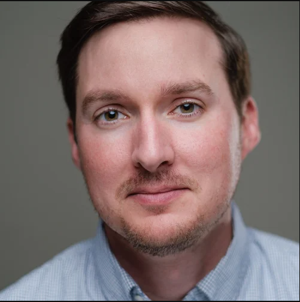
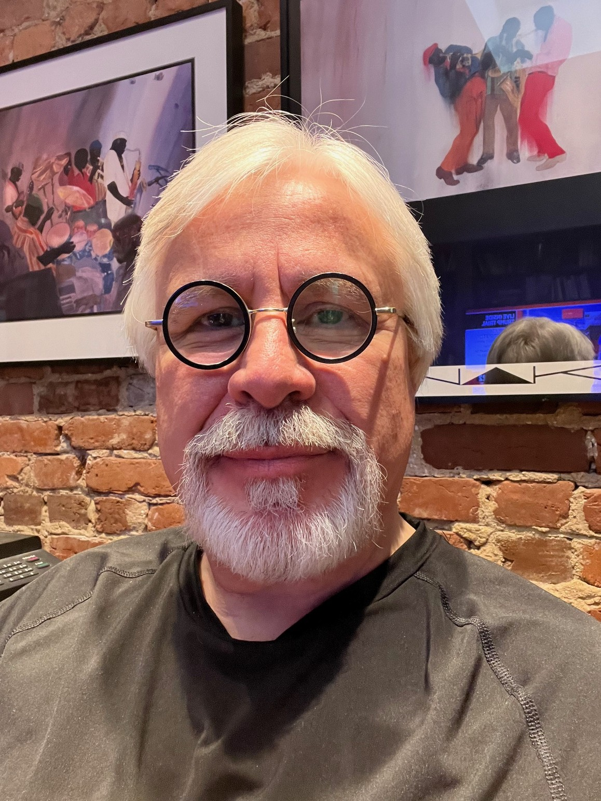
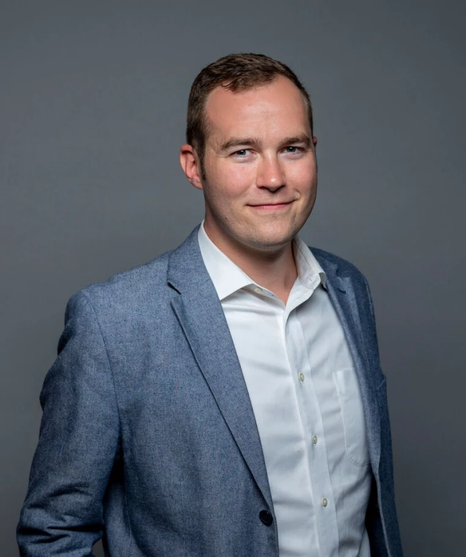
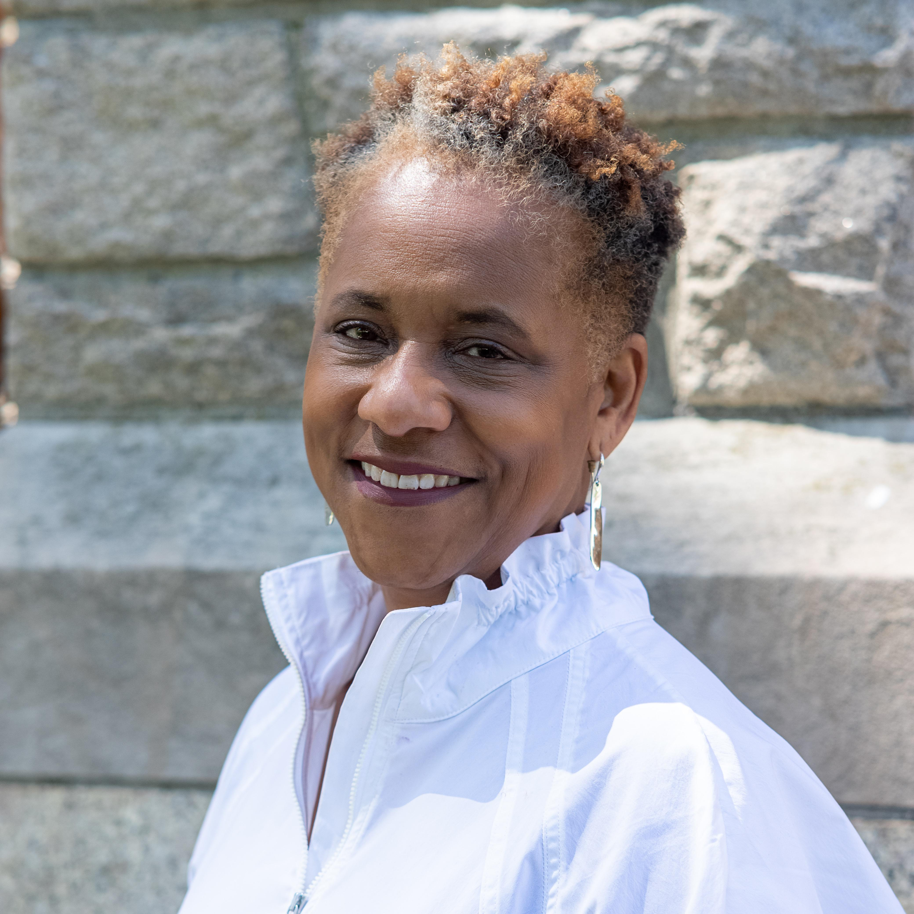

::: {style="text-align: center; color: #036ffc;"}
# Dow Jones News Fund Data Guest Speakers 2025

[(ver May 17, 2026)]{style="font-size: 8pt;"}
:::

::: {style="display: flex; align-items: center; justify-content: center; gap: 20px; margin-top: 30px;"}

:::

::: {style="text-align:center"}
<button><a href="https://djnf-data-2026.github.io/master/">Home</a></button>

<button><a href="https://djnf-data-2026.github.io/master/Instructors">Instructors</a></button>

<button><a href="https://djnf-data-2026.github.io/master/GuestSpeakers">Guest
Speakers</a></button>

<button><a href="https://djnf-data-2026.github.io/master/Interns">Interns</a></button>
:::

**Chad Day**

Chad Day is [chief elections analyst at The Associated
Press](https://blog.ap.org/chad-day-named-chief-elections-analyst). Day
is a member of AP’s Decision Desk and writes about politics and
elections. Previously, he was a national political reporter for The Wall
Street Journal in Washington and an investigative reporter at the
Associated Press. He was part of a team at the Journal awarded the 2023
Pulitzer Prize in Investigative Reporting for a series of stories
exposing federal conflicts of interest.

He is an adjunct lecturer at Georgetown University School of Continuing
Studies where he teaches data journalism for master's students. He is a
former investigative reporter for the Arkansas Democrat-Gazette. He
earned a Bachelor's degree in journalism from the University of Missouri
at Columbia.

 

**Rev. Brian Hamilton**

Hamilton is [pastor and preacher at the Westminister Presbyterian Church
(USA)](https://westminsterdc.org/our-pastor) in Southwest Washington,
D.C. Hamilton serves the community as President of the SW Renaissance
Development Corporation that runs Westminster's Jazz and Blues ministry
that resulted in the award-winning programs Friday Night Jazz, Blue
Monday Blues, Thinking About Jazz, SW Catering and more. He has lived
and worked in the community for nearly three decades and is passionate
about improving community relations and the social and economic
conditions of Southwest residents.

 

**Jon Schleuss**

Jon (he/him/his) grew up in rural Arkansas reading the morning Arkansas Democrat-Gazette and the afternoon Camden News. He found his way into journalism through college radio. He became the online editor of the Northwest Arkansas Democrat-Gazette at age 21, moving the paper to do more breaking news, use social media and report live election results. In 2013 he joined the Los Angeles Times as a data and graphics journalist, writing and telling innovative stories using computer programming. He taught journalism students how to code at the University of Southern California. He was part of the group of workers who organized the Times in 2018. He ran for president and won in 2019. As NewsGuild president, Jon serves on the Executive Board of the CWA. He lives in Washington, D.C.

 

**Deborah Barfield Berry**

Deborah Barfield Berry, a 2023 Nieman Fellow at Harvard University and Pulitzer Prize winner, is a former national correspondent for USA TODAY, where she focused on voting rights, civil rights and politics. She became director of Merrill College's Capital News Service Annapolis bureau in January 2026.

She leads Merrill College students in their daily coverage of the Maryland State House and issues important to Marylanders.

Berry, an award-winning journalist, has spent most of her journalism career in Washington, D.C., where she has covered Congress and national politics. She serves as president of the board for the Washington Press Club Foundation.

 

