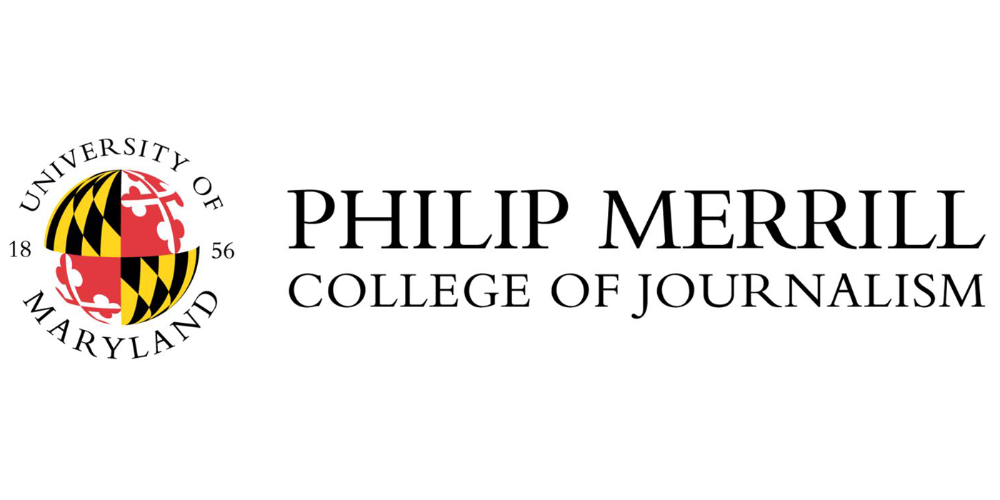
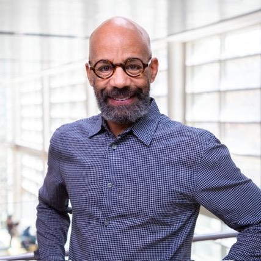
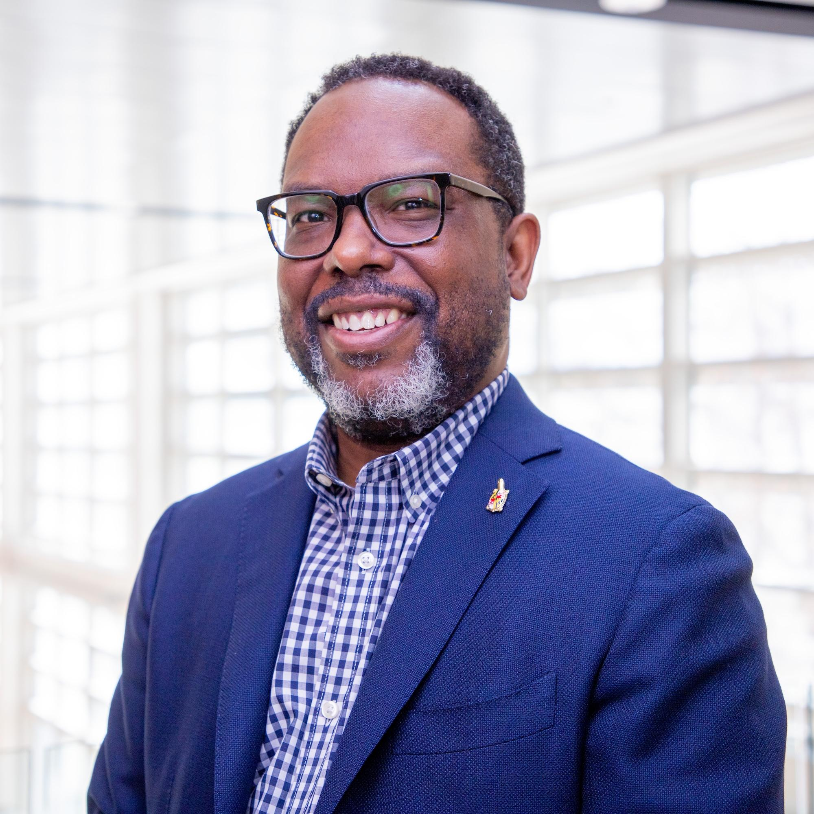

::: {style="text-align: center; color: #036ffc;"}
# Dow Jones News Fund Data Instructors

[(ver May 22, 2025)]{style="font-size: 8pt;"}
:::

::: {style="display: flex; align-items: center; justify-content: center; gap: 20px; margin-top: 30px;"}

:::

**Kevin Blackistone**

Kevin Blackistone is a longtime national sports columnist now at The
Washington Post, a panelist on ESPN’s “Around the Horn,” a contributor
to National Public Radio and coauthor of “A Gift for Ron,” a memoir by
former NFL star Everson Walls published in November 2009 that details
his kidney donation to onetime teammate Ron Springs.

Blackistone was a sports columnist for AOL Fanhouse from October 2007 to
March 2011 and an award-winning sports columnist for The Dallas Morning
News from September 1990 to September 2006.

Blackistone is a recipient of numerous awards, including awards for
sports column writing from the Texas Associated Press Managing Editors,
for investigative reporting from the Chicago Newspaper Guild and for
enterprise reporting from the National Association of Black Journalists.

 

**Karen Denny**

Karen Denny is Merrill College's director of internships and career
development. She previously served as the Annapolis bureau director of
the Capital News Service, until taking over leadership of the career
center at the beginning of 2022. Denny is a former editor with the
McClatchy-Tribune (formerly Knight Ridder/Tribune) News Service, where
she founded the wire’s Newsfeatures and International sections, and most
recently was a features editor.

She previously worked as the Maryland editor for The Washington Times,
and at the suburban Journal Newspapers as an editor and local government
reporter. She also served as a professor at Sang Ji University in Won
Ju, South Korea.

 

**David Herzog**\

David Herzog is a veteran investigative reporter, data journalist and
educator with more than 30 years of experience. He enjoys discovering
how journalists can use data analysis tools to uncover the news better.
Herzog teaches data journalism to student and professional journalists.
He speaks frequently about investigative reporting, data journalism and
access to information.

As the academic adviser to the National Institute for Computer-Assisted
Reporting, he helps guide data services for Investigative Reporters and
Editors. IRE is a global organization with more than 5,000 members based
at the Journalism School. He helps direct the Dow Jones News Fund’s data
journalism residency program for IRE.

He is part of the interdisciplinary team that launched the online M.S.
in Data Science and Analytics program at the University of Missouri. He
developed and teaches a data journalism class geared toward
professionals for the program.

He’s reported for The Providence Journal, The Baltimore Sun, and The
Morning Call in Allentown, Pa. He’s won or shared in national, regional
and state awards for investigations into political corruption, child
lead poisoning and lax workplace safety.

 

**Adam Marton**

Adam Marton is an award-winning journalist and graphic designer who
joined the Philip Merrill College of Journalism in 2018 after 13 years
at The Baltimore Sun.

Marton is focused on quality storytelling across media, using design and
technology to tell rich, human stories. He is a visual journalist and
designer specializing in the presentation of the news, including data
visualization, front-end development and information graphics.

 

**Constance Mitchell Ford**

Constance Mitchell Ford, a 1977 University of Maryland graduate, is a
financial journalist who spent more than three decades covering
economics, banking, investing and real estate.

Most of those years were spent at The Wall Street Journal in New York,
most recently as the Global Real Estate and Property Bureau Chief. Under
her leadership, reporters in the real estate group won dozens of
journalism awards. Ford personally received the Scripps Howard National
Journalism Award for business and economics reporting in 2007 for
stories about the subprime mortgage crisis.

 

**Sean Mussenden**

Sean Mussenden, a former Washington correspondent, is the data editor
for the Howard Center for Investigative Journalism. He previously
oversaw an experiential, hands-on journalism training program at Merrill
College that is integral to the college’s “teaching hospital” model of
professional instruction: Capital News Service.

He also teaches traditional courses incorporating data visualization,
programming, web development, web design, data analysis, social media
and computational journalism. Mussenden was appointed to the rank of
principal lecturer in 2023.

 

**Bridget Lang**

Bridget Lang is a software developer for the University of Maryland. In
2024, she earned her bachelor’s degree in computer science with an
upper-level concentration in journalism. A Baltimore County native, Lang
uses her skills in software development, data, and writing to tell
stories in the best way possible. She has had articles published in the
Baltimore Banner and Capital News Service and is assisting Wells on a
research project about an influential conservative journalist.

 

**Christoph Mergerson**

Christoph Mergerson, who completed his Ph.D. in Communication,
Information and Media at Rutgers University, joined the Philip Merrill
College of Journalism in Fall 2021 as a visiting assistant professor. He
was appointed to the rank of assistant professor in Fall 2022.

Mergerson's research and teaching interests include journalism history,
weather journalism, race and media, and journalism and democracy.
Mergerson arrived at Merrill with ongoing research that examines whether
news media in the Southern United States are producing racially
inclusive, public-service journalism. He brings award-winning classroom
experience from teaching courses at Rutgers, including Communication Law
and Global News.

 

**Daniel Trielli**

Daniel Trielli joined the Philip Merrill College of Journalism's faculty
in Fall 2023 as assistant professor of media and democracy.

He researches the impact of algorithmic curation on journalism and
political information, and studies how Google affects the news and the
audiences that use it to search. He is interested in data and
computational journalism, media literacy and algorithmic accountability.
Trielli came to Merrill College as a master's student in 2015 after a
10-year career as a journalist in Brazil at the national newspaper, O
Estado de S. Paulo, and the regional newspaper, Diário do Grande ABC.

 

**Rob Wells**

Rob Wells, a 2016 Ph.D. alum of Merrill College, returned to the
university in the Spring 2022 semester after more than five years at the
University of Arkansas, where he rose to the rank of associate professor
and led Arkansas' journalism graduate program. Wells has more than two
decades of business journalism experience at The Associated Press,
Bloomberg News and The Wall Street Journal.

Wells is the author of “The Enforcers: How Little-Known Trade Reporters
Exposed the Keating Five and Advanced Business Journalism” (2019) and
"The Insider: How the Kiplinger Newsletter Bridged Washington and Wall
Street" (2022).

 

**Derek Willis**

Derek Willis, one of the nation’s leading data journalists and an
experienced educator, joined the Philip Merrill College of Journalism in
Fall 2021 as a lecturer in data and computational journalism.

Willis came to Merrill College having spent 25 years winning awards at
some of the top news outlets in the country. His latest stop was
ProPublica, where he served as a news applications developer since 2015.

He previously held interactive journalism roles with The New York Times
and The Washington Post, after working as a database reporter for The
Washington Post, The Center for Public Integrity, Congressional
Quarterly and The Palm Beach Post.
