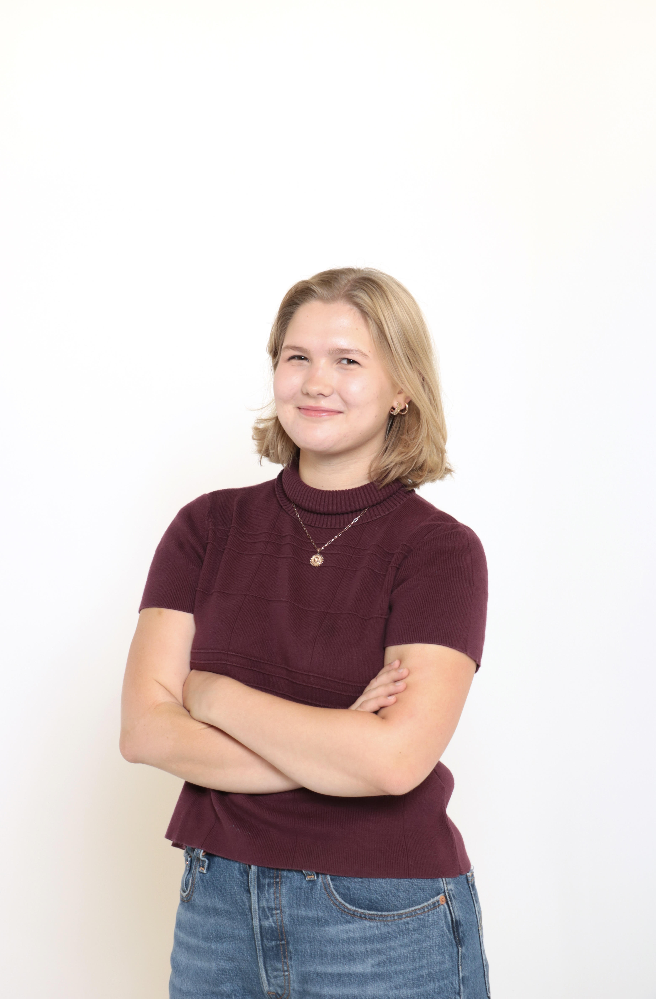
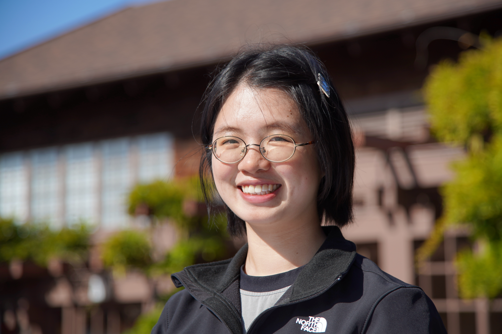

::: {style="text-align: center; color: #2ba9dc;"}
# Dow Jones News Fund Data Interns 2026

[(ver May 22, 2025)]{style="font-size: 8pt;"}
:::

::: {style="display: flex; align-items: center; justify-content: center; gap: 20px; margin-top: 30px;"}

:::

::: {style="text-align: center; color: #2ba9dc;"}
:::
::: {style="float:right; padding:10px;"}
Emily Wilson studies at Craig Newmark Graduate School of Journalism at CUNY and will intern at the Advertising Specialty Institute
:::

::: {style="float:right; padding:10px;"}
Casey Mann studies at University of Arkansas - Fayetteville and will intern at the Arkansas Democrat-Gazette
:::

::: {style="float:right; padding:10px;"}
Laine Cibulskis studies at University of Missouri - Columbia and will intern at Detroit News
:::

::: {style="float:right; padding:10px;"}
Julie Lee studies at Columbia University and will intern at the Howard Center for Investigative Journalism
:::

::: {style="float:right; padding:10px;"}
Diego Torrealba studies at University of Texas at Austin and will intern at the Howard Center for Investigative Journalism
:::

::: {style="float:right; padding:10px;"}
Tiasia Saunders studies at University of Maryland and will intern at the Investigative Project on Race and Equity
:::

::: {style="float:right; padding:10px;"}
Ela Jalil studies at University of Maryland and will intern at the Investigative Reporting Workshop
:::

::: {style="float:right; padding:10px;"}
Will Hammann studies at University of Maryland and will intern at the Maryland Matters
:::

::: {style="float:right; padding:10px;"}
Izzy Farina studies at University of Georgia and will intern at the NJ Advance Media
:::

::: {style="float:right; padding:10px;"}
Yaelle Tang studies at University of California, Berkeley and will intern at the Philadelphia Inquirer
:::

::: {style="float:right; padding:10px;"}
/Samuel Gauntt studies at University of Maryland and will intern at the States Newsroom D.C. Bureau
:::

::: {style="float:right; padding:10px;"}
Katelynn Winebrenner studies at University of Maryland and will intern at The Frederick News-Post
:::

::: {style="float:right; padding:10px;"}
Teresa Do studies at University of Texas at Austin and will intern at The Trace
:::

::::

::::::::::
