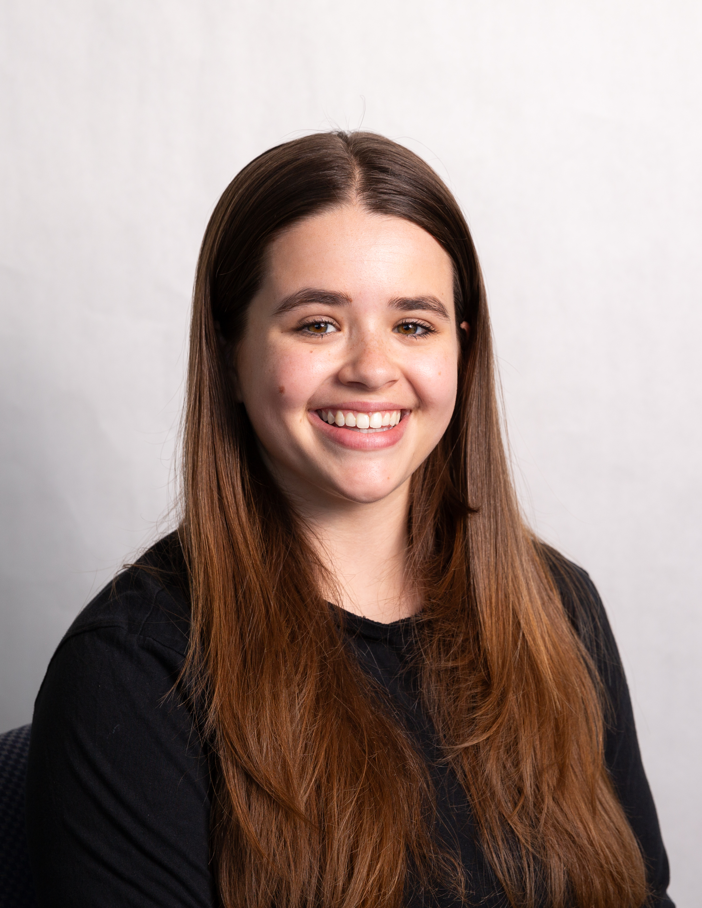
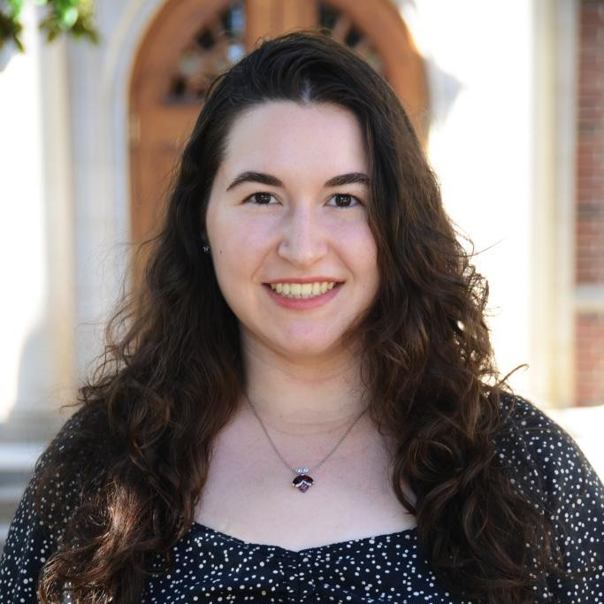
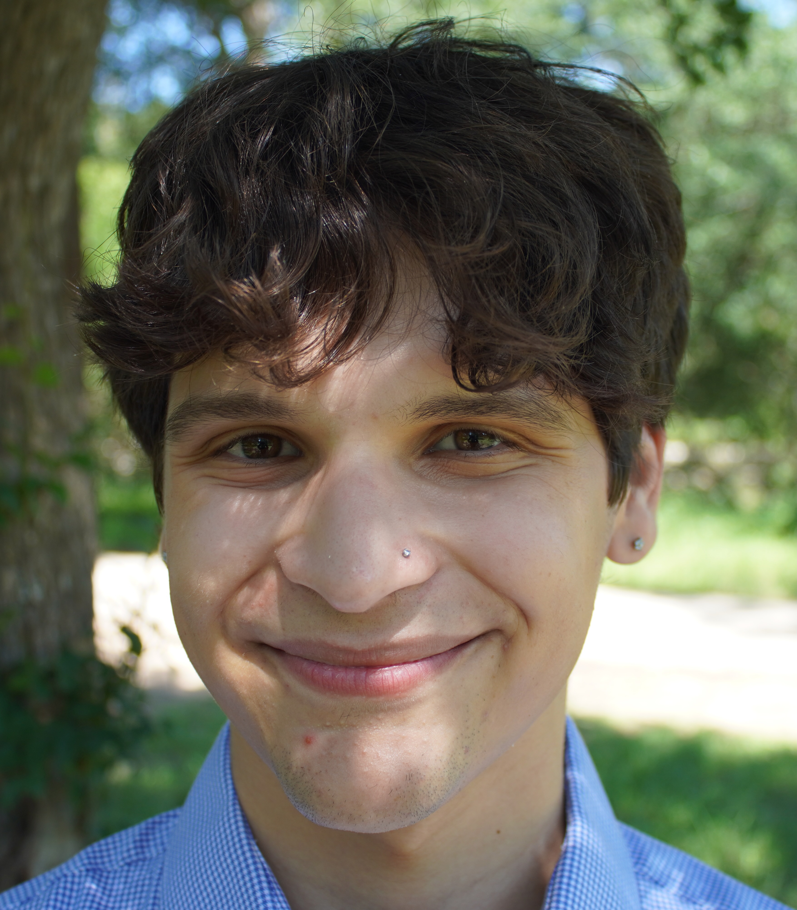
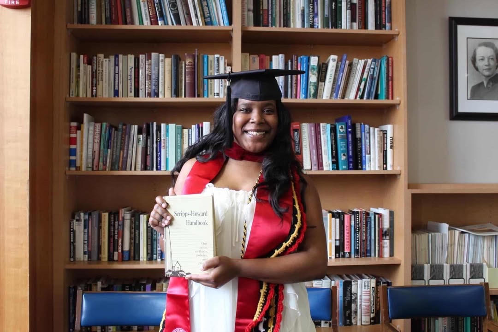
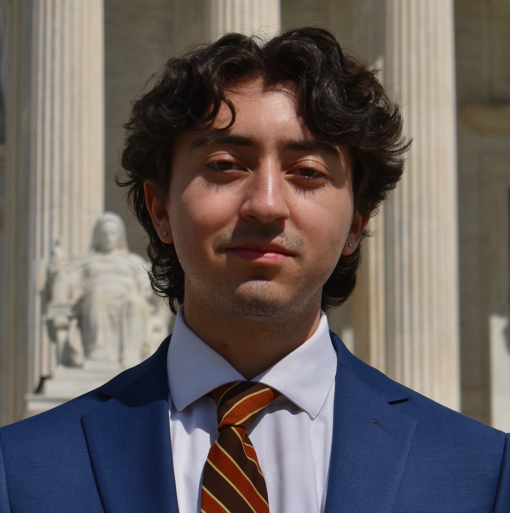
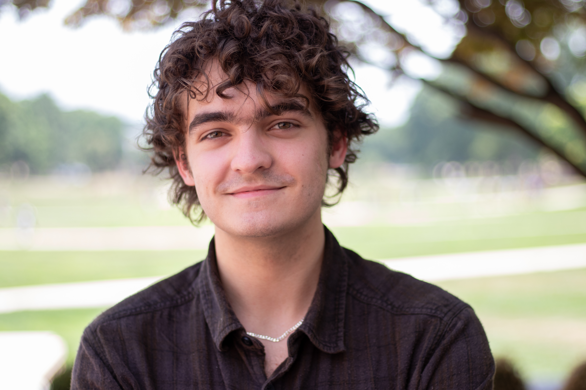
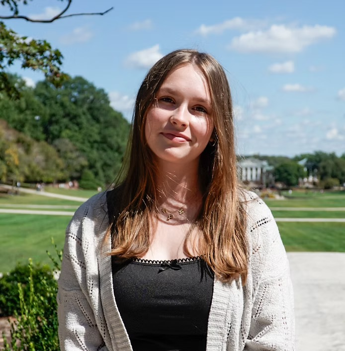

::: {style="text-align: center; color: #2ba9dc;"}
# Dow Jones News Fund Data Interns 2026

[(ver May 17, 2026)]{style="font-size: 8pt;"}
:::

::: {style="display: flex; align-items: center; justify-content: center; gap: 20px; margin-top: 30px;"}

:::

::: {style="text-align:center"}
<button><a href="https://djnf-data-2026.github.io/master/">Home</a></button>

<button><a href="https://djnf-data-2026.github.io/master/Instructors">Instructors</a></button>

<button><a href="https://djnf-data-2026.github.io/master/GuestSpeakers">Guest
Speakers</a></button>

<button><a href="https://djnf-data-2026.github.io/master/Interns">Interns</a></button>
:::

::: {style="float:right; padding:10px;"}
#### The data projects listed below are draft story proposals.
:::

::: {style="float:right; padding:10px;"}
Emily
Wilson studies at Craig Newmark Graduate School of Journalism at CUNY
and will intern at the Advertising Specialty Institute

  Emily Wilson's [DJNF
project](https://djnf-data-2026.github.io/emily-wilson/)

  Tiasia Saunders [profile of Emily
Wilson](https://docs.google.com/document/d/1C_2FIzjwnEtyTAnYMT0h4Lphau8qXZDjsGC7jt6gQCQ/edit?usp=sharing)
:::

::: {style="float:right; padding:10px;"}

Casey Mann studies at University of Arkansas - Fayetteville and will
intern at the Arkansas Democrat-Gazette

Casey Mann's [DJNF
project](https://djnf-data-2026.github.io/casey-mann/)

Ela Jalil's [profile of Casey
Mann](https://docs.google.com/document/d/1eIvNA_rvDEAQaPRqtmjHejnS0NBWIOsypK294XLr8eA/edit?tab=t.0)
:::

::: {style="float:right; padding:10px;"}
Laine
Cibulskis studies at University of Missouri - Columbia and will intern
at Detroit News

Laine Cibulskis's [DJNF
project](https://djnf-data-2026.github.io/laine-cibulskis/)

Will Hammann’s [profile of Laine
Cibulskis](https://docs.google.com/document/d/18IIz_KItM-azLEMfF4btVsSLpPDxlOIHwifvDpbTlAE/edit?usp=sharing)
:::

::: {style="float:right; padding:10px;"}
Julie
Lee studied at Columbia University and will intern at the Howard Center
for Investigative Journalism

Julie Lee's [DJNF project](https://djnf-data-2026.github.io/julie-lee/)

Isabella Farina’s [profile of Julie
Lee](https://docs.google.com/document/d/1psO4tH97Kmxqj2sVlpMw8xaXDTDywh7EGZsN7_ujw2M/edit?tab=t.0)
:::

::: {style="float:right; padding:10px;"}
Diego
Torrealba studies at University of Texas at Austin and will intern at
the Howard Center for Investigative Journalism

Diego Torrealba's [DJNF
project](https://djnf-data-2026.github.io/diego-torrealba/)

Sam Gauntt's profile of Diego
Torrealba, TK

:::

::: {style="float:right; padding:10px;"}
Tiasia
Saunders studied at University of Maryland and will intern at the
Investigative Project on Race and Equity

Tiasia Saunders's [DJNF
project](https://djnf-data-2026.github.io/tiasia-saunders/webpage/index.html)

Emily Wilson's [profile of Tiasia
Saunders](https://docs.google.com/document/d/1uEAu7hG9LCLCQWXaZUgQwaJd03o7o5hv5T910N0JUjg/edit?usp=sharing)
:::

::: {style="float:right; padding:10px;"}
Ela
Jalil studied at University of Maryland and will intern at the
Investigative Reporting Workshop

Ela Jalil's [DJNF project](https://djnf-data-2026.github.io/ela-jalil/)

Casey Mann's [profile of Ela
Jalil](https://docs.google.com/document/d/1dWlHJ9LArNsU3hhyCJF7FqHGcxPEmdWD4Ca2YCwp6K8/edit?usp=sharing)
:::

::: {style="float:right; padding:10px;"}
Will
Hammann studies at University of Maryland and will intern at the
Maryland Matters

Will Hammann's [DJNF
project](https://djnf-data-2026.github.io/will-hammann/)

Laine Cibulskis' [profile of Will
Hammann](https://docs.google.com/document/d/1pKk2wePl_FIC0xILWbTVVVwgU-i2uHQMNKQTxMUDHKA/edit?usp=sharing)
:::

::: {style="float:right; padding:10px;"}
Isabelle
"Izzy" Farina studied at University of Georgia and will intern at the NJ
Advance Media

Izzy Farina's [DJNF
project](https://djnf-data-2026.github.io/isabelle-farina/)

Julie Lee's [profile of Izzy
Farina](https://docs.google.com/document/d/17hd43hoXlJFzzsE0cbMOgVzchHBGd34RUosL9p9S9qE/edit?tab=t.0)
:::

::: {style="float:right; padding:10px;"}
Yaelle
Tang studies at University of California, Berkeley and will intern at
the Philadelphia Inquirer

Yaelle Tang's [DJNF
project](https://djnf-data-2026.github.io/yaelle-tang/)

Katelynn Winebrenner’s [profile of Yaelle
Tang](https://docs.google.com/document/d/10egsZSSdpLtxX-dJZgZMsvf3h3UQ8VOE8Lx7TYpCLeY/edit?usp=sharing)
:::

::: {style="float:right; padding:10px;"}
Sam
Gauntt studies at University of Maryland and will intern at the States
Newsroom D.C. Bureau

Sam Gauntt's [DJNF
project](https://djnf-data-2026.github.io/samuel-gauntt/)

Diego Torrealba's [profile of Sam
Gauntt](https://docs.google.com/document/d/1hVFgJeCJP6Wmyi7KV2-xLWiy4kHxG9vh/edit?usp=sharing&ouid=102324743793755798467&rtpof=true&sd=true)
:::

::: {style="float:right; padding:10px;"}
Katelynn
Winebrenner studied at University of Maryland and will intern at The
Frederick News-Post

Katelynn Winebrenner's [DJNF
project](https://djnf-data-2026.github.io/katelynn-winebrenner/)

Teresa Do's [profile of Katelynn
Winebrenner](https://docs.google.com/document/d/1s-J0K-uZ8G66D-1ij2aFMAF2ZwHTFQheHa1azgmPbUc/edit?usp=sharing)
:::

::: {style="float:right; padding:10px;"}
Teresa
Do studies at University of Texas at Austin and will intern at The Trace

Teresa Do's [DJNF project](https://djnf-data-2026.github.io/teresa-do/)

Yaelle Tang's [profile of Teresa
Do](https://docs.google.com/document/d/1E6p9SMxuZJz3es2iQWNk_KPymIcJ_hg3-uY6mcxQuCM/edit?tab=t.lpd0mlyr49iw)
:::

