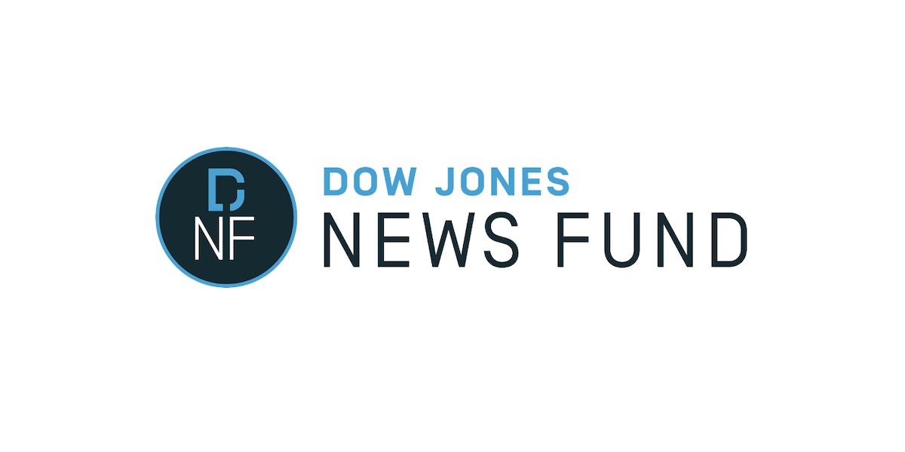
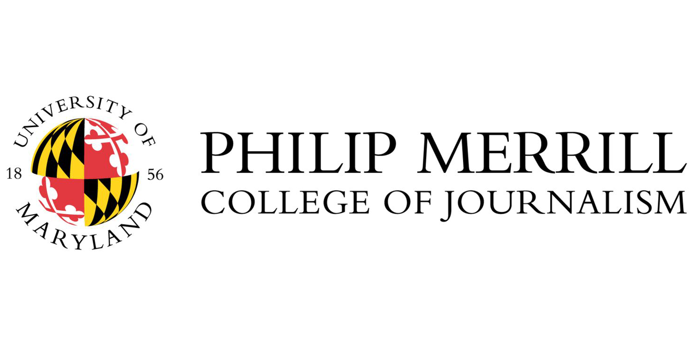
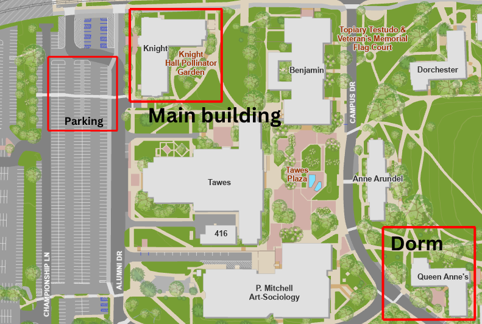

::: {style="text-align: center; color: #E21833;"}
# Dow Jones News Fund

# Data Journalism Training
:::

::: {style="display: flex; align-items: center; justify-content: center; gap: 20px; margin-top: 30px;"}

:::

::: {style="text-align: center; color: #ff9500;"}
### Dow Jones News Fund \@ Merrill College

#### Sunday, May 31 - Sunday, June 7, 2026

(ver May 28, 2026)
:::

 

::: {style="text-align:center; color: #000000"}
<button><a href="https://djnf-data-2026.github.io/master/Instructors">Instructors</a></button>

<button><a href="https://djnf-data-2026.github.io/master/GuestSpeakers">Guest
Speakers</a></button>

<button><a href="https://djnf-data-2026.github.io/master/Interns">Interns</a></button>
:::

::: {style="text-align: center; color: #E21833;"}
## Itinerary
:::

:::::: {style="text-align: left;color: #000000;"}
### Wifi Instructions 
- [Get your wifi user - password here](https://docs.google.com/document/d/1YA0H5VASofnWRyhU9RkHGakqotXkqKTAF4VCyiZa68g/edit?usp=sharing)

### Food Orders
- [Put your food orders on this doc for breakfast, lunch and some dinners](https://docs.google.com/document/d/1BBUUojXX92cFusVN75Dwjo9pMkwj9FAh7uhz3XWWoJA/edit?usp=sharing)

### Pre-Conference

- **By May 25**: Students will be sent a data starter kit to load
  relevant software on their laptops and test out their equipment.
- **By May 27**: Students profiles due, 11:59 p.m.
- **By May 29**: Students will have data assignments described.

### Sunday, May 31, 2026

- **2 p.m.**: Welcome at Knight Hall Eaton Theater. (Wells, Denny, Lang and Shirley Carswell, DJNF Executive Director)
  - Logistics. The week ahead: rooms, meals.
  - [Wifi instructions](https://docs.google.com/document/d/1YA0H5VASofnWRyhU9RkHGakqotXkqKTAF4VCyiZa68g/edit?usp=sharing)
  - Student introductions.
- **3:30 p.m.**: Break
- **3:45 p.m.**: Investigate Your Community.
  - Review starter code, data memos, develop story ideas. (Wells)
  - New to Coding Track, getting started with R: Casey, Izzy, Laine
    (Lang) Knight 2103\
- **4:30 p.m.**: Break and then independent work
  - Produce draft story ideas by 11:59 p.m.
- **5:30 p.m.**: Break
- **6:00 p.m.**: Dinner in Hyattsville - (Meet at Knight Hall board van). 
- [Readings before Mergerson
    talk](https://docs.google.com/document/d/15uYP18yQFVcWvv_qn-Je-GnVElMT2wkLPx5DHxn9If8/edit?usp=sharing)
    
- **11:59 p.m.**: One paragraph draft story ideas.
  - This will reflect that you have read the data memo in your Google
    Doc folder, the guidance from your newsroom and have conducted a
    preliminary review of the data. This one paragraph will show you
    have engaged with this material and produced a story idea that could
    be discussed with an editor. Don't worry, you can change and refine
    your idea as the week goes on. This is a first step. Submit as a
    Google Doc or an R Markdown document. Remember to allow permission
    sharing for Google Docs. Email links to Wells:
    [robwells\@umd.edu](mailto:robwells@umd.edu){.email} and
    [kdenny12\@umd.edu](mailto:kdenny12@umd.edu){.email}

### Monday, June 1, 2026

- **8 a.m.: Breakfast**: In Knight Hall

- **9 a.m.**: Meet at Knight Hall

- **Skills sessions. Pick one**

  - Coding Experienced Track: Data Driven Reporting. (Aidan Hughes, the
    Howard Center) Room 2103
    - Web scraping in R: rvest, rplaywright
    - PDF data extraction: pdftools
    - Hidden APIs
  - New to Coding Track: Importing Data. (Wells) Room 2107
    - Creating a R Markdown notebook
    - Importing and analyzing data
    - Basic queries.

- **10:30 a.m.**: Heather Taylor, DJNF, discussion. Eaton Theater

- **10:45 a.m.**: Break. Coffee served. Lobby.

- **11 a.m.**: Workshops: Use data to find stories. (Wells, Hughes,
  Lang) Rooms 2103, 2107

- **12:30 p.m.**: Lunch in Knight Hall.

- **1:30 p.m.**: Writing a story pitch memo. All attend. (Denny) Room
  2103

  - [Slides for
    talk](https://docs.google.com/presentation/d/1zdlk2Ss9jE_SZL2HuHvUbZeUteEO0OBasFKpXtjuZIY/edit?usp=sharing)
  - [Story Based Inquiry book](https://www.storybasedinquiry.com/manual2)
  - [Story Pitch Database](https://www.theopennotebook.com/pitch/scientists-describe-a-new-fishing-spider-species/) 
  

- **2:15 p.m.**: Hosting a GitHub page. All attend. (Wells/Lang) [Download GitHub page tutorial](https://github.com/djnf-data-2026/master/blob/main/code/Hosting_GitHub_Page_DJNF_2026.qmd)
      - Render a basic web page using R and GitHub pages.

- **2:45 p.m.**: Workshop for [story pitch memo due at 11:59
  p.m.](https://docs.google.com/document/d/1A-dlzWX7ksOt6LRHYpuPDk7SPPWxyZEmGt2wC0lM7Mg/edit)
  (Wells, Denny, Lang coach). Rooms 2103, 2107

- **4 p.m.-5 p.m.**: Diversity is Good Journalism: Covering All of the
  Community. (Prof. Christoph Mergerson). All attend. Eaton Theater.
  
  - [Slides from discussion](https://docs.google.com/presentation/d/1DmWV83cpv7FdH0kg9P819eRiVLVKyTZX/edit?usp=sharing&ouid=102324743793755798467&rtpof=true&sd=true)
  
  - [Readings before Mergerson
    talk](https://docs.google.com/document/d/15uYP18yQFVcWvv_qn-Je-GnVElMT2wkLPx5DHxn9If8/edit?usp=sharing)

- **5:30 p.m.**: Break

- **6:30 p.m.**: Dinner on campus

- Readings for Tuesday: 
  - [Pushed Too Far](https://cnsmaryland.org/interactives/spring-2021/pushed-too-far/)
  - [Black college athletes can send a message to Ron DeSantis by staying away](https://www.washingtonpost.com/sports/2024/03/11/florida-gators-dei-ron-desantis/) 
  

- **11:59 p.m.**: Draft a story pitch memo due.

- A minimum of 400 words, building on the story idea paragraph, that
  incorporates some of the best practices in pitching a story and
  generally follows the story pitch template and process as described in
  Monday’s lecture. This draft pitch will reflect a deeper exploration
  of the assigned data and hopefully some independent research. The best
  story pitches will have some context about recent coverage of this
  topic. Submit as an R Markdown document, providing a link to your
  GitHub account; entry level interns have the option of submitting a
  Google Doc. Email links to Wells:
  [robwells\@umd.edu](mailto:robwells@umd.edu){.email} and
  [kdenny12\@umd.edu](mailto:kdenny12@umd.edu){.email}

### Tuesday June 2, 2026

- **8 a.m.: Breakfast**: In Knight Hall

- **9 a.m. - 10:30 a.m.: Skills sessions**

  - Coding Experienced Track: Using AI with R. (Derek Willis, the Howard
    Center) Room 2103
    - Use R to link to a LLM and process data: the ellmer package
    - Parsing data and text
    - The beat book.
    - [LLM playground](https://github.com/NewsAppsUMD/llm-playground)

  - New to Coding Track: Data cleaning. (Hughes) Room 2017
    - Use Open Refine, R to clean data
    - Render a basic web page using R and GitHub pages.

- **10:45 a.m.**: Break. Coffee served.

- **11 a.m.**: Workshop. Students work on data gathering story pitches.
  (Wells, Willis, Hughes, TA as coaches). Room 2103, 2107

- **12 p.m.**: Lunch in Knight Hall.

- **1 p.m.-2:30 p.m.: Data Visualization.** . Using Datawrapper for data
  visualization. (Adam Marton). All attend. Eaton Theater

  - Embedding Datawrapper into GitHub pages
  - [Use HTML to hack a DataWrapper map](https://docs.google.com/document/d/1-YiRkfjo15E6nX6GUN7AwGLpsr6EI27hp72exrZAN4M/edit?usp=sharing)
  - [Use the DataWrapper API to create graphics in R](https://adammarton.com/?p=2861)
  

- **2:30 p.m.-2:45 p.m.** : Break

- **2:45 p.m.-4 p.m.** : Workshop on your projects. (Wells / Marton /
  Lang)

- **4 p.m.-5 p.m.**: Speaker: Prof. Kevin Blackistone on racial justice
  in sports business
  - Readings: 
  - [Pushed Too Far](https://cnsmaryland.org/interactives/spring-2021/pushed-too-far/)
  - [Black college athletes can send a message to Ron DeSantis by staying away](https://www.washingtonpost.com/sports/2024/03/11/florida-gators-dei-ron-desantis/)
  

- **5:30 p.m.**: Break

- **6 p.m.**: Dinner in Hyattsville. Walk to Greene Turtle, 7356 Baltimore Ave, College Park, MD 20740.
  
- [Readings before Jon Schleuss talk](https://docs.google.com/document/d/1V325-4V1iExFS30EWRWZC2X6zZEXjmAJ-ZWhJFiIS5k/edit?usp=sharing)

### Wednesday June 3, 2026

- **8:30 a.m.: Breakfast**: In Knight Hall

- **9 a.m.-10:15 a.m.: Skills sessions**

  - Coding Experienced Track: Using AI with R. (Daniel Trielli, Merrill
    College) Room 2103
    - Risks of each application. 
    - Tool demo: Pinpoint for document mining. 
    - Mapping tasks to tools. Together we will determine which AI technique or tool we need for each phase of a project.
    - The AI News Game: a board game to consider the trade-offs for adapting AI tools.
    

  - New to Coding Track: Analyzing your data (Wells) Room 2107
    - Using the Tidyverse to summarize and analyze data.
    - More on rendering web page using R and GitHub pages.

- **10:15 a.m.**: Break. Coffee served.

- **10:30 a.m.**: Workshop. Open workshop on projects. (Wells, Trielli,
  Lang coach). Rooms 2103, 2107

- **11:30 a.m. - 12:30 p.m.**: Keynote speaker: [Jon Schleuss,
  President, The News Guild](https://newsguild.org/staff/). Eaton
  Theater.

  - [Readings before Jon Schleuss talk](https://docs.google.com/document/d/1V325-4V1iExFS30EWRWZC2X6zZEXjmAJ-ZWhJFiIS5k/edit?usp=sharing)

- **12:30 p.m.**: Lunch with Schleuss

- **1:30 p.m. - 2:30 p.m.**: Introduction to business reporting.
  (Wells). Eaton Theater

- **2:30 p.m. - 3 p.m.**: Digital accessibility for data visualization.
  (Lang). Eaton Theater

- **3 p.m. - 6 p.m.**: Workshop on your projects. (Wells, Lang, Denny)

- **6 p.m.**: Dinner on campus

- **11:59 p.m.**: Second draft of story pitch memos due. –A minimum of
  600 words, this will build on Monday’s work. It will include at least
  one graphic, building on the Tuesday graphics workshop, and some
  summary data analysis, building on the data workshops since Sunday.
  This pitch should include summary tables, basic analysis, questions,
  and a discussion of potential holes. It will include a paragraph about a major 
  employer in your community that's important to watch. The best pitches 
  will cover two topics and have a rendered page from your GitHub account. Submit as an
  R Markdown document, providing a link to your GitHub account. Email
  links to Wells: [robwells\@umd.edu](mailto:robwells@umd.edu){.email}
  and [kdenny12\@umd.edu](mailto:kdenny12@umd.edu){.email}

### Thursday June 4, 2026

- **8 a.m.: Breakfast**: In Knight Hall

- **8:30 a.m.**: Meet at Knight Hall, board van, depart for College Park
  Metro (Wells driving, plus car pool to Metro)
- **10 a.m.**: Tour of AP D.C. bureau with Chad Day, AP's elections
  team.
- **12 p.m.**: Lunch.
- **1:30 p.m.**: Tour U.S. Senate press gallery with Prof. Deborah
  Berry, Philip Merrill College of Journalism.
- **6 p.m.**: Dinner in Washington D.C.

### Friday June 5, 2026

- **8:30 a.m.: Breakfast**: In Knight Hall
- **9 a.m.-10 a.m.**: Skills to survive in the newsroom. Time
  management, deadlines. All attend. (Denny) Eaton Theater.
- **10:00 a.m. - 10:15 a.m.**: Break
- **10:15 a.m.-12:30 p.m.**: Workshop on projects (Wells, Denny, Lang
  coach)
- **12:30 p.m.-1:30 p.m.**: Lunch in Knight Hall
- **3:30 p.m.**: Meet at Knight Hall, board van, depart for College Park
  Metro, dinner in Washington D.C., attend a community jazz show at
  [Westminster Church](https://westminsterdc.org/our-pastor). Meet with
  Pastor Brian E. Hamilton beforehand to discuss Southwest D.C. history

### Saturday June 6, 2026

- **8:30 a.m.: Breakfast**: In Knight Hall
- **9:00 a.m.**: Present your story pitch to the group. –This will be a
  webpage rendered from your GitHub account that includes at least three
  graphics, several summary tables, and a written analysis. Entry level
  interns have the option of presenting slides. Two separate story
  pitches will be presented, along with questions and a discussion of
  potential holes. Email links to Wells:
  [robwells\@umd.edu](mailto:robwells@umd.edu){.email} Shirley Carswell,
  DJNF Executive Director, visits
- **12:15 p.m.**: Lunch in Knight Hall
- **1 p.m.**: On the van for D.C.
- **2:30 p.m.**: Tour of African-American History Museum, D.C.
- **5:30 p.m.**: Dinner.

### Sunday June 7, 2026

- Breakfast available at dining hall.
- Depart on your own schedule

::: {style="text-align: center; color: #ff9500;"}
## Resources
:::

**Campus Map**

  **Data Journalism Text**

[Data Journalism with R and the
Tidyverse](https://thescoop.org/data_journalism_book/)

 

### Important Contacts

 

**Rob Wells, 443-591-1189. email:
[robwells\@umd.edu](mailto:robwells@umd.edu){.email}**

 

**Karen Denny, 301-775-8483. email:
[kdenny12\@umd.edu](mailto:kdenny12@umd.edu){.email}**

**Bridget Lang, 443-608-4961. email:
[blang\@umd.edu](mailto:blang@umd.edu){.email}**

**Residence Halls & Campus**

::: {}
- Jennifer Bradley, Senior Program Manager. Office:301-314-0323 Mobile: 301-440-9276 Email:
  [jarsen17\@umd.edu](mailto:jarsen17@umd.edu){.email}

- Aishwarya Ramesh, Assistant Program Manager. Mobile: 301-440-9277. Email: [aishram1\@umd.edu](mailto:aishram1@umd.edu){.email}

- Queen Anne’s Hall (For mail/key/access-related questions):
  301-314-4455 (HILL)

- Residential Facilities (To report an issue with your room/residence
  hall) 301-314-9675 (WORK) Campus Information 301-405-1000
:::

**Medical/Emergency Contacts**

::: {}
- Emergency (University of Maryland Police) 301-405-3333
- Emergency (Prince George’s County Police) 911
- Non-Emergency (University of Maryland Police) 301-405-3555
- University Health Center 301-314-8180
:::
::::::

